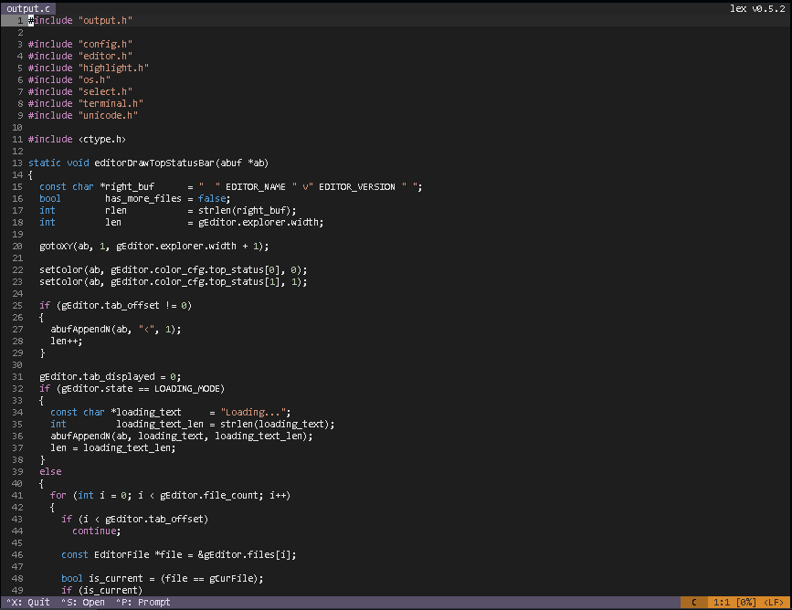

# Lex



Lex is a lightweight, simple, and terminal-based text editor, inspired by GNU Nano. It aims to provide a clean, responsive, and distraction-free editing experience for developers who prefer to stay in the terminal. Unlike full-featured IDEs, Lex focuses on simplicity and essential features only.

## ✨ Features

🧩 Familiar Interface — Simple and minimal layout inspired by Nano

🎨 Syntax Highlighting — Basic syntax support for common languages (C, C++, Python, etc.)

🧭 Lightweight & Fast — Runs smoothly on any terminal without heavy dependencies

💾 Basic File Operations — Create, open, edit, and save files easily

🧠 Undo/Redo Support — Undo mistakes with a single shortcut

🖱️ Mouse Support (Optional) — Click to move or select text if supported by your terminal

⚙️ Customizable Settings — Change tab width, line numbers, and more using simple commands

## 📦 Installation

This project uses CMake for the build and installation process, replacing traditional shell scripts.

### Requirements

- C compiler (GCC or Clang)
- CMake 3.15+
- Make or other CMake-compatible build tool

### Build and Install

Follow these steps to build and install Lex on your system:

| Step | Command | Description |
|------|---------|-------------|
| 1. Clone Repository | `git clone https://github.com/danko1122q/LEX.git && cd LEX` | Clone the project and navigate to its directory |
| 2. Create Build Directory | `mkdir build` | Create a build directory in the project root |
| 3. Enter Build Directory | `cd build` | Navigate into the build directory |
| 4. Configure Project | `cmake ..` | Generate makefiles and configure the project |
| 5. Compile | `make -j$(nproc)` | Compile the source code using all available CPU cores |
| 6. Install System-wide | `sudo make install` | Copy the executable to a system directory (e.g., /usr/local/bin). Requires root access. This also creates the installation manifest. |

**Quick Installation (One-liner):**

```bash
git clone https://github.com/danko1122q/lex.git && cd lex && mkdir build && cd build && cmake .. && make -j$(nproc) && sudo make install
```

## 🗑️ Uninstallation

The uninstall target is created using CMake. This is the recommended method to remove the installed executable from your system. It works by reading a manifest file generated during installation.

| Step | Command | Description |
|------|---------|-------------|
| 1. Enter Build Directory | `cd build` | Navigate to the directory where you ran the installation |
| 2. Run Uninstall | `sudo make uninstall` | Uses the stored file list (install_manifest.txt) to remove each installed item. Requires root access. |

**Example:**

```bash
cd /path/to/LEX/build
sudo make uninstall
```

**Note:** The uninstall process relies on install_manifest.txt, which is automatically created in the build directory when you run sudo make install. Make sure you run the uninstall command from the same build directory where you performed the installation.

## 🧹 Full Cleanup (Purge)

The purge target provides a comprehensive cleanup. It first runs the uninstall target to remove all installed files from your system, and then deletes the entire build directory, including all cache, object files, and the compiled binary. This is the best way to completely remove all traces of the project from your machine.

| Step | Command | Description |
|------|---------|-------------|
| 1. Enter Build Directory | `cd build` | Navigate to the directory to be cleaned |
| 2. Run Purge | `make purge` | Uninstalls the program and then removes all contents in the /build directory. |

**Example:**

```bash
cd /path/to/LEX/build
make purge
cd ..
```

**Note:** After running purge, the build directory will be completely removed. You will need to start the installation process from the beginning if you want to reinstall the project.

## 🚀 Usage

Run Lex from your terminal:

```bash
lex [filename]
```

If no filename is given, a new empty buffer will open.

### Interface Overview

- **Editor Area** — Main text input and editing area
- **Status Bar** — Displays file name, cursor position, and quick help
- **Command Line (Optional)** — Access basic configuration commands

## ⌨️ Keyboard Shortcuts

| Shortcut | Action |
|----------|--------|
| Ctrl + O | Save file |
| Ctrl + X | Exit editor |
| Ctrl + G | Show help |
| Ctrl + W | Search text |
| Ctrl + K | Cut current line |
| Ctrl + U | Paste text |
| Ctrl + Z | Undo |
| Ctrl + Y | Redo |

## ⚙️ Configuration

Use the internal command prompt (Ctrl + P) to change editor behavior.

**Example commands:**

```
set tabsize 4
set lilex 1
set helpinfo 0
```

## 🐛 Troubleshooting

### Installation Issues

**CMake not found:** Install CMake using your package manager

```bash
# Debian/Ubuntu
sudo apt install cmake

# Fedora/RHEL
sudo dnf install cmake

# Arch Linux
sudo pacman -S cmake
```

**Permission denied during install:** Make sure to use sudo for the install command

**Build fails:** Ensure you have a C compiler installed

```bash
# Install GCC
sudo apt install build-essential  # Debian/Ubuntu
sudo dnf install gcc              # Fedora/RHEL
```

### Uninstallation Issues

**install_manifest.txt not found:** This error occurs if the uninstall command cannot find its log of installed files. This typically happens for two reasons:

1. You never ran sudo make install in the first place.
2. You deleted the build directory (e.g., with make purge or rm -rf build) after installing, which also removed the manifest file.

If the program is still installed, you can remove it manually:

```bash
sudo rm /usr/local/bin/lex
```

**Permission denied:** Remember to use sudo for uninstall operations.

## 📜 License

Lex is distributed under a Modified MIT License (Non-Commercial). You are free to use, modify, and fork this project for personal or educational purposes.

Commercial redistribution or resale is not allowed without written permission from the author.

© 2025 danko1122q — All rights reserved. See the LICENSE file for full details.

## 🙏 Acknowledgments

- **GNU Nano & nino** — for inspiring the simplicity and interface design
- **Open Source Community** — for tools, libraries, and continuous support
- **Contributors** — who help improve and maintain the project

## 🔗 Links

- **Repository:** github.com/danko1122q/LEX
- **Issues:** Report a bug or request a feature
- **Pull Requests:** Submit a contribution
